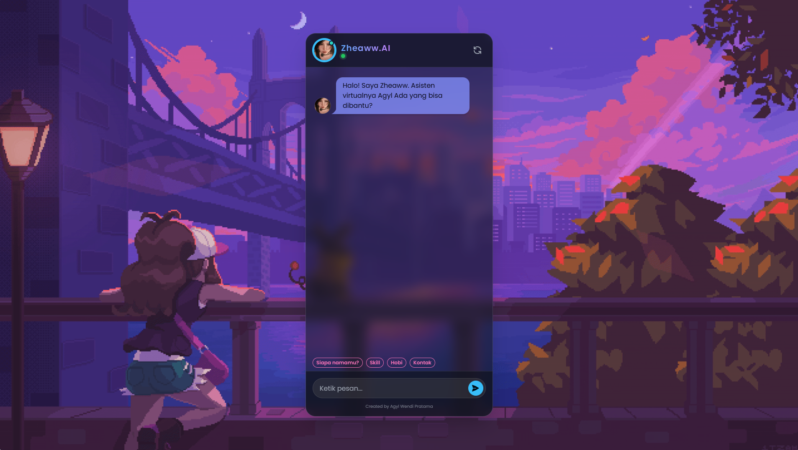

# 🤖 Zheaww.AI - ChatBot Sederhana Tentang Saya

Zheaww.AI adalah chatbot interaktif berbasis web yang berfungsi sebagai **Asisten Virtual Pribadi** untuk memperkenalkan diri saya (Agyl Wendi Pratama). Dibangun dengan desain modern **Glassmorphism** dan logika cerdas untuk menangani percakapan natural.



## 🚀 Fitur Utama

* **🧠 Hybrid Logic:** Menggunakan kombinasi *Keyword Matching* dan *Fuzzy Logic* (algoritma `difflib`) sehingga bot tetap mengerti meskipun pengguna *typo* (salah ketik).
* **🎨 Glassmorphism UI:** Tampilan antarmuka modern dengan efek kaca (blur), animasi halus, dan latar belakang bergerak.
* **⚡ Fast Response:** Dibangun dengan **Flask** yang ringan dan cepat.
* **📱 Responsive:** Tampilan menyesuaikan layar (Desktop & Mobile Friendly).

## 🛠️ Teknologi yang Digunakan

* **Backend:** Python, Flask
* **Frontend:** HTML5, Tailwind CSS, DaisyUI, JavaScript (Fetch API)
* **Logic:** Python `difflib` (SequenceMatcher)

## 📦 Cara Menjalankan Project

1.  **Clone repository ini**
    ```bash
    git clone [https://github.com/likeazwee/Zheaww-AI.git](https://github.com/likeazwee/ChatBot-Sederhana.git)
    cd ChatBot-Sederhana
    ```

2.  **Install Library yang dibutuhkan**
    ```bash
    pip install -r requirements.txt
    ```

3.  **Jalankan Server**
    ```bash
    python app.py
    ```

4.  **Buka Website**
    Buka browser dan kunjungi `http://127.0.0.1:5000` (atau buka file `index.html` secara langsung jika mode statis).

## 📝 Contoh Percakapan
Coba tanya hal berikut kepada bot:
* "Siapa namamu?"
* "Skill kamu apa aja?"
* "Kamu punya pacar?" (Easter egg!)
* "Kontak yang bisa dihubungi"

---
Created by **Agyl Wendi Pratama**
